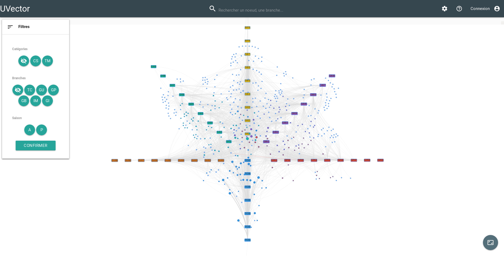

# UVector
A project aiming to make students' course selection easier.

## Deployment

You just need **docker** to deploy UVector.

On the root directory run

    make

Or to run it on dev mode (you also need node and [nodemon](https://github.com/remy/nodemon))

    make dev

Once the server is deployed you need to add the data to neo4j.

Go to the endpoint ```/setup/db``` once the server is done you also have to go to  ```/setup/calc```.

## Screenshot


